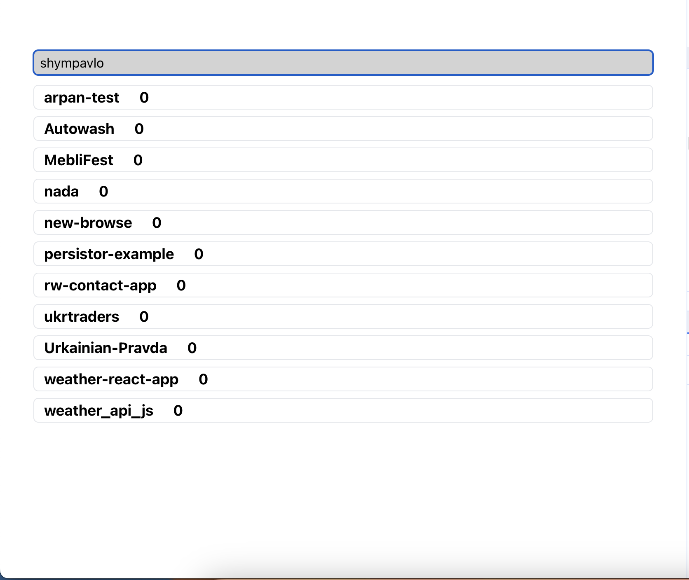
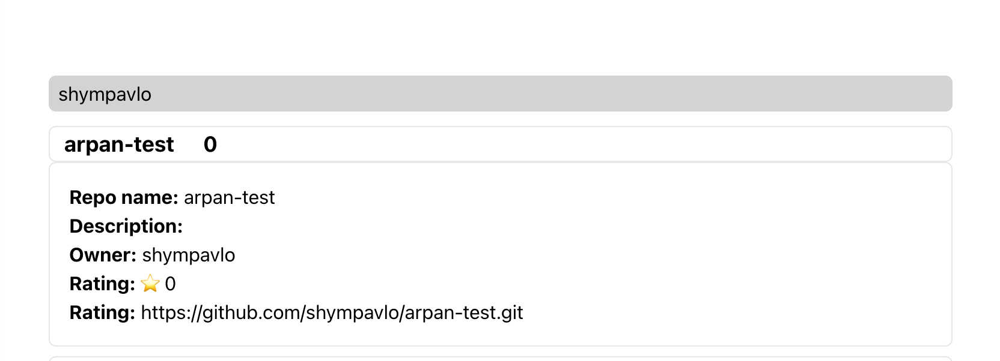

### What I have built

Created the test task to search the repositories by github username and show the information about repository

### How to test

// npm install
// npm start

### Any feedback/notes

Nothing was hard or confused

